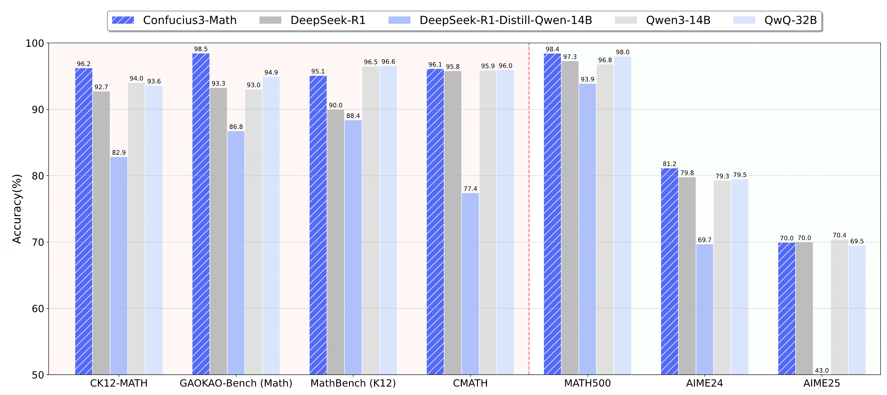

# Confucius3-Math
<!-- markdownlint-disable first-line-h1 -->
<!-- markdownlint-disable html -->
<!-- markdownlint-disable no-duplicate-header -->

<div align="center">
  
</div>
<hr>

<div align="center" style="line-height: 1;">
💜 <a href="https://confucius.youdao.com/"><b>Confucius Demo</b></a>&nbsp;&nbsp; | &nbsp;&nbsp;🤗 <a href="https://huggingface.co/netease-youdao">Hugging Face</a>&nbsp;&nbsp; | &nbsp;&nbsp;🤖 <a href="https://modelscope.cn/organization/netease-youdao">ModelScope</a>&nbsp;&nbsp; | &nbsp;&nbsp;⌨️ <a href="https://github.com/netease-youdao/Confucius3-Math">GitHub</a>&nbsp;&nbsp; | &nbsp;&nbsp;📚 <a href="https://github.com/netease-youdao/Confucius3-Math/blob/main/Confucius3-Math.pdf">Paper</a>&nbsp;&nbsp; | &nbsp;&nbsp;💬 <a href="https://github.com/netease-youdao/Confucius3-Math/blob/main/assets/wechat.png">Wechat</a>
<br> 
<a href=""></a> 

</div>

<h4 align="center">
    <p>
        <a href="README_cn.md">中文</a> | <b>English</b>
    <p>
</h4>

## 📑 Confucius3-Math: A Lightweight High-Performance Reasoning LLM for Chinese K-12 Mathematics Learning

<div align="center">
  
</div>

## Quick Links

- [1 Model Downloads](#1-model-downloads)
- [2 Introduction](#2-introduction)
- [3 Performance](#3-performance)
- [4 Inference](#4-inference)
- [5 Quickstart](#5-quickstart)

## 1 Model Downloads
| **Model** | **HuggingFace** | **ModelScope** | **WiseModel** |
| :------------: | :------------: | :------------: | :------------: |
| Confucius3-Math | [🤗 HuggingFace](https://huggingface.co/netease-youdao/Confucius3-Math) | [ModelScope](https://modelscope.cn/models/netease-youdao/Confucius3-Math) | [WiseModel](https://www.wisemodel.cn/models/Netease_Youdao/Confucius3-Math) |


## 2 Introduction
Confucius3-Math is a **14B parameter open-source resoning LLM** developed by the NetEase Youdao AI Team, specifically optimized for K-12 mathematics education. Unlike general-purpose models, Confucius3-Math:

✅ **SOTA Performance on Math Tasks**

Outperforms larger models on Chinese K-12 math problems through specialized RL training

✅ **Cost-Effective Deployment**

Runs efficiently on a single consumer-grade GPU (e.g., RTX 4090D)

✅ **Cultural & Curriculum Alignment**

Optimized for China's national mathematics standards and problem-solving methodologies

Confucius3-Math was developed through an RL-only post-training process with novel data scheduling policy and improved group-relative advantage estimator. Please refer to our technical report  for details.


## 3 Performance

<div align="center">


| Benchmark | DeepSeek-R1 | Qwen3-14B | QwQ-32B | DeepSeek-R1-Distill-Qwen-14B | Confucius3-Math |
|-------------------|----------------------|------------|--------------|----------------|------------|
| CK12-MATH | 92.74 | 94.04 | 93.60 | 82.86 | 96.24 |
| GAOKAO-Bench(math) | 93.27 | 94.44 | 94.93 | 86.75 | 98.46 |
| MathBench(K12) | 89.99 | 96.51 | 96.57 | 88.40 | 95.10 |
| CMATH | 95.81 | 95.90 | 95.95 | 77.41 | 96.13 |
| MATH-500 | 97.30 | 96.80 | 98.00 | 93.90 | 98.80 |
| AIME 2024 | 79.80 | 79.30 | 79.50 | 69.70 | 81.15 |
| AIME 2025 | 70.00 | 70.40 | 69.50 | 42.97 | 69.95 |

</div>

## 4 Inference
The environmental requirements for running it are exactly the same as those of the [Qwen2.5-14B-Instruct](https://huggingface.co/Qwen/Qwen2.5-14B-Instruct) model. Therefore, you can easily use Transformers or vLLM to load and run the model for inference, and deploy your services.

The only thing you need to pay attention to is to use the predefined system message and user message templates provided below to request the model. Other templates may also be usable, but we haven't tested them yet.
```python
SYSTEM_PROMPT_TEMPLATE = """A conversation between User and Assistant. The user asks a question, and the Assistant solves it. The assistant first thinks about the reasoning process in the mind and then provides the user with the answer. The reasoning process and answer are enclosed within <think> </think> and <answer> </answer> tags, respectively, i.e., <think> reasoning process here </think> <answer> answer here </answer>."""

USER_PROMPT_TEMPLATE = """{question}"""
```

Then you can create your `messages` as follows and use them to request model results. You just need to fill in your instructions in the "question" field.
```python
from transformers import AutoModelForCausalLM, AutoTokenizer

model_name = "netease-youdao/Confucius3-Math"

model = AutoModelForCausalLM.from_pretrained(
    model_name,
    torch_dtype="auto",
    device_map="auto"
)
tokenizer = AutoTokenizer.from_pretrained(model_name)

messages = [
    {'role': 'system', 'content': SYSTEM_PROMPT_TEMPLATE},
    {'role': 'user', 'content': USER_PROMPT_TEMPLATE.format(question=question)},
]

text = tokenizer.apply_chat_template(
    messages,
    tokenize=False,
    add_generation_prompt=True
)
model_inputs = tokenizer([text], return_tensors="pt").to(model.device)

generated_ids = model.generate(
    **model_inputs,
    max_new_tokens=32768
)
generated_ids = [
    output_ids[len(input_ids):] for input_ids, output_ids in zip(model_inputs.input_ids, generated_ids)
]

response = tokenizer.batch_decode(generated_ids, skip_special_tokens=True)[0]
```
> [!NOTE]
> **Generate Parameters**: We suggest using Temperature=1.0, TopP=0.7 to sample.

After obtaining the model results, you can parse out the "thinking" and "summary" parts as follows.
```python
def parse_result_nostep(result):
     think_pattern = r"<think>(.*?)</think>(.*)"

    think_list = re.findall(think_pattern, result, re.DOTALL)

    assert len(think_list) == 1, \
        f"The parsing results do not meet the expectations.\n{result}"

    think = think_list[0][0].strip()
    summary = think_list[0][1].strip()
    return think, summary

thinking, summary = parse_result_nostep(response)
```
You can find the code in `model/hf_demo.py`

## 5 Quickstart
This project uses the vLLM backend to launch the Confucius3-Math service and builds an interactive Web interface based on Gradio.  

We recommend using Docker to launch the Demo. The way to use Docker is as follows:  
```
# Generate the image
docker build -t confucius3 .
# Start the container service
docker run -e ARK_API_KEY=xxx -p 8827:8827 confucius3
```  
The `ARK_API_KEY` can be created on [Volcano Engine](https://console.volcengine.com/), which is mainly used for OCR of input images. If you do not need to support image input, you can skip setting this environment variable.  

After the service is launched, you can visit http://127.0.0.1:8827/ to experience the capabilities of Confucius3-Math.  

You can also manually install it via the following command:  
```
pip install -r requirements.txt
```  
After installing the relevant dependencies, you can use the following script to launch the Demo service:  
```
export ARK_API_KEY=xxx 
bash run_service_stream.sh
```  


## Citation
If you find our work helpful, feel free to give us a cite.
```
@misc{confucius3-math,
   author = {NetEase Youdao Team},
   title = {Confucius3-Math: A Lightweight High-Performance Reasoning LLM for Chinese K-12 Mathematics Learning},
   url = {https://huggingface.co/netease-youdao/Confucius3-Math},
   month = {June},
   year = {2025}
 }
```
